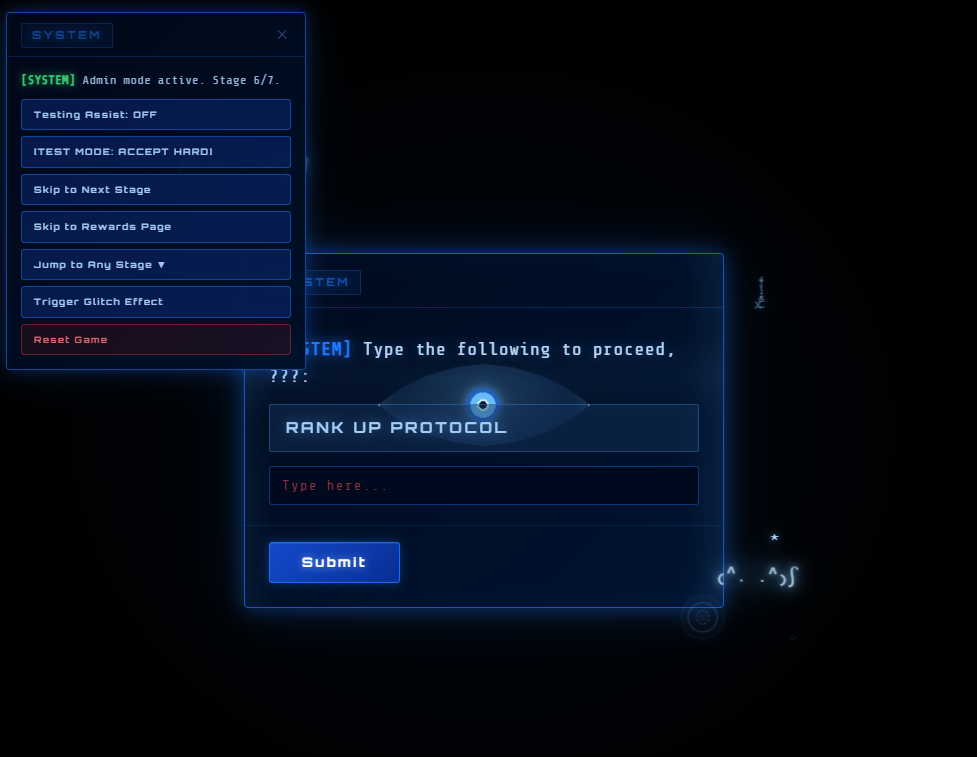

# Ragebait System UI (Ragebait Interaction Project)

A deliberately frustrating, game-like UI inspired by Solo Leveling system prompts.

This is not meant to be a “good UX” project.  
It’s designed to **annoy, mislead, and test user patience** through staged interactions.

---

## What this is

An interactive multi-stage system popup where the user progresses through a series of increasingly annoying challenges:

- Fake buttons  
- Glitch effects  
- Input corruption  
- Timed pressure  
- Moving targets  
- Deceptive UI feedback  

The goal is simple: **get to the end**  
The experience is not.

---

## Live Concept
[SYSTEM] Daily quest unlocked.
→ Accept
→ Accept again
→ Recalculating difficulty...
→ Identity verification
→ Maths (but not really)
→ Typing verification
→ Button boss fight
→ “Reward”

---

## Core Features

### Stage-based progression (1–7)

Each stage introduces a different type of interaction:

#### Stage 1 – Accept Button
- Button dodges cursor  
- Fake confirmation (2-step accept)  
- Glitch transition  

#### Stage 2 – Fake Processing
- “Recalculating difficulty”  
- Pure delay + psychological setup  

#### Stage 3 – Identity Verification
- Input corruption while typing  
- Timer pressure  
- “Slowpoke” fallback message  

#### Stage 4 – Fake Loading
- Progress bar stuck at 99%  
- Ends in fake error  

#### Stage 5 – Maths (Ragebait)
- Moving answer buttons  
- Shuffling options  
- Speed requirement  
- Skip option that punishes user with a title  

#### Stage 6 – Phrase Typing
- Input gets corrupted mid-typing  
- Requires exact phrase match  
- Multiple failure states  

#### Stage 7 – Button Boss (8 Levels)

1. Spam honesty button (with fake setbacks)  
2. Moving + shrinking + wobbling button (looping phases)  
3. Multiple buttons (only some are real)  
4. Delayed click trap  
5. Hold mechanic (don’t release early)  
6. Rhythm-based clicking  
7. Stamina drain vs spam  
8. One-frame reaction test  

---

## Admin / Testing Mode

Hidden admin panel allows:

- Stage skipping  
- Testing assist (makes things easier)  
- Accept button cheat mode  
- Stage 7 difficulty adjustments  
- Trigger glitch effects  
- Reset system  

Password: hunter

---

## Tech Stack

- React (functional components)  
- TypeScript  
- Custom CSS  
- Replit  

---

## Project Goals

This project explores:

- Anti-UX design  
- User frustration mechanics  
- Perception vs interaction  
- Timing-based difficulty  
- Psychological baiting in UI  

---

## Current State

Ongoing project.

Recent work:
- Improving Stage 7 difficulty  
- Adding glitch transitions  
- Refining admin controls  
- Fixing rendering bugs  

## Note

This version is intentionally still quite easy in some parts (especially Stage 7 Level 2).

The project is ongoing and I’m actively making each stage more difficult and more deceptive over time.

The goal is to push the interaction further into “unfair but still playable” territory.
---

## Known Issues

- Admin skipping can break some states  
- Timing differs on slower devices  
- Stage 7 still being tuned  

---

## Future Improvements

- More aggressive glitch effects  
- Sound design  
- Mobile optimisation  
- More deceptive UI mechanics  

---

## Why this exists

Because normal UI is boring.

This project intentionally creates:
- misleading feedback  
- unfair mechanics  
- frustrating flows  

If users get annoyed… it’s working.

## Screenshot Sample

